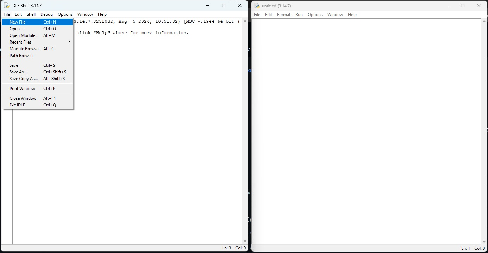
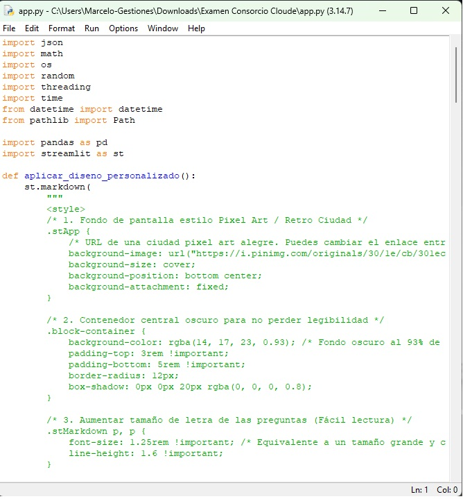
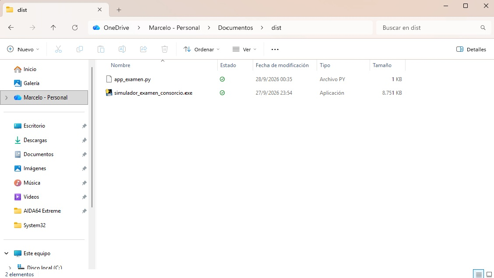
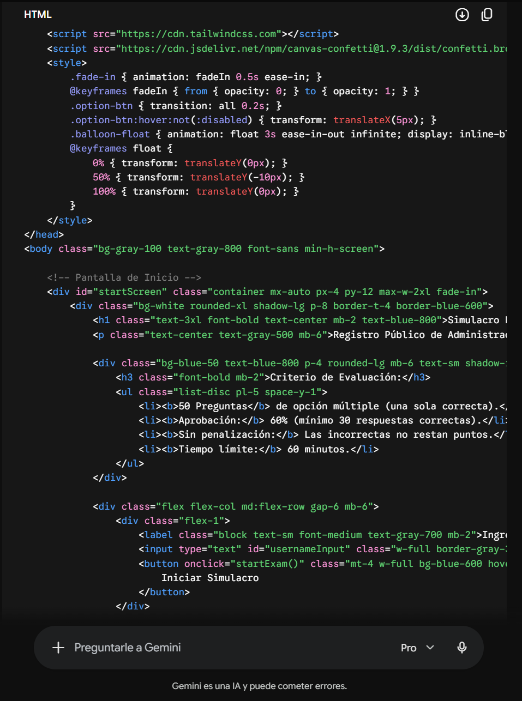
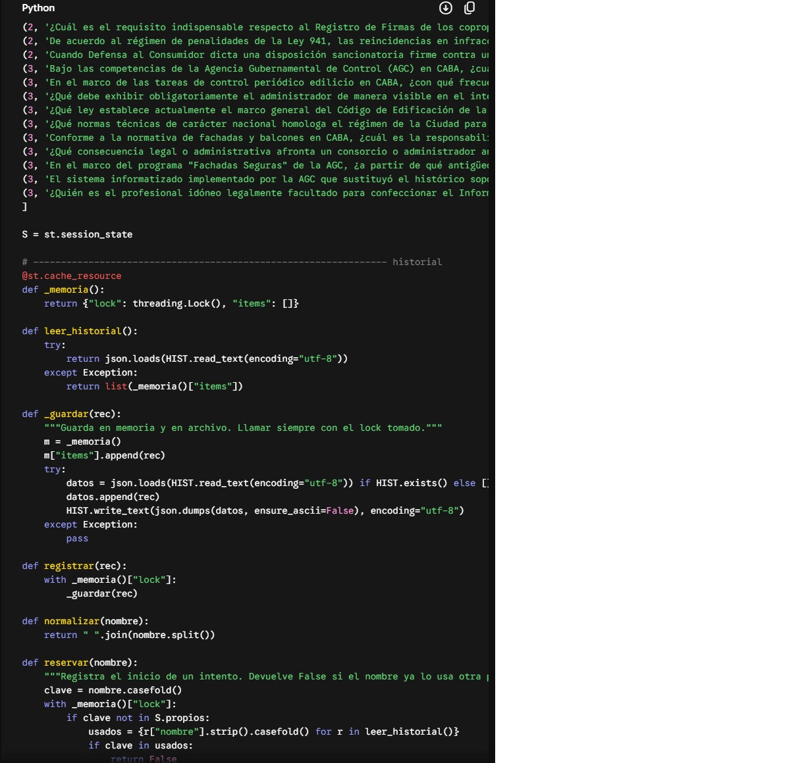
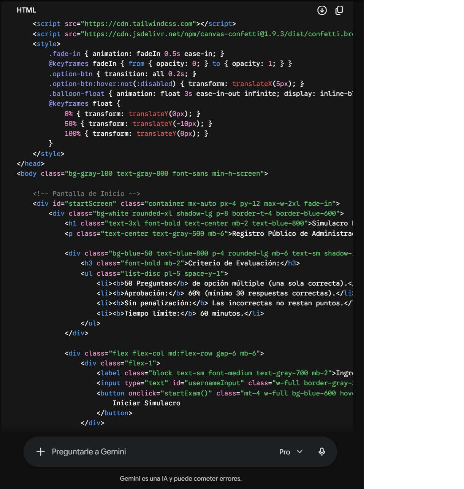
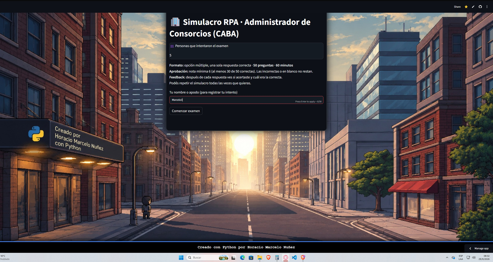

# Examen_Final_Simulador-RPA-CABA
Examen de practica para administracion de consorscio final by Python proyecto 1.0.1

Aquí tienes el informe redactado en primera persona, con un tono profesional, fluido y sin repeticiones, ideal para documentar y reportar tu trabajo en el repositorio de GitHub:

---

# Informe de Desarrollo y Creación: Simulador de Examen RPA CABA

## 1. Introducción y Propósito del Proyecto

El presente proyecto nace de la necesidad de contar con una herramienta interactiva, veraz y de alta calidad para la práctica y el repaso previo al **Examen de Idoneidad Obligatorio** para la matriculación como Administrador de Consorcios en el **Registro Público de Administradores (RPA)** de la Ciudad Autónoma de Buenos Aires.

Tras la modificación del formato de evaluación a un sistema escrito (regulado por la normativa vigente y la Disposición 3395/DGDYPC/26), desarrollé esta aplicación de práctica con el objetivo de consolidar mis conocimientos en programación con **Python** y, al mismo tiempo, ofrecer un recurso de estudio útil tanto para mí como para mis compañeros de curso y cualquier aspirante a la profesión.

---

## 2. Investigación y Recopilación de Fuentes Oficiales

Para garantizar la máxima precisión técnica y legal, realicé una búsqueda exhaustiva de información en canales oficiales del **Gobierno de la Ciudad de Buenos Aires**. Los ejes temáticos evaluados en el simulador se estructuraron bajo los siguientes pilares normativos:

* **Normativa Legal y Profesional:** Ley N° 941 de CABA (régimen del RPA, deberes, infracciones y sanciones) y el Código Civil y Comercial de la Nación (Libro Cuarto, Título V - Propiedad Horizontal).

* **Administración y Finanzas:** Liquidación de expensas, manejo de cuentas bancarias obligatorias, contabilidad básica y dinámica de asambleas.

* **Relaciones Laborales:** Marco legal del personal de edificios y Convenio Colectivo de Trabajo (SUTERH).

* **Seguridad Edilicia y AGC:** Control de ascensores, instalaciones fijas contra incendios (IFCI), limpieza semestral de tanques de agua y el programa de Fachadas Seguras (actualizado conforme a la Ley N° 6.116 a partir de los 15 años de antigüedad del inmueble).

---

## 3. Metodología de Desarrollo: Paso a Paso

El proceso de construcción del software se llevó a cabo mediante una metodología iterativa de prueba y error, combinando lógica de programación, diseño de interfaces y control de versiones:

1. **Estructuración de Contenidos:**
* Recolecté y redacté un banco inicial de 50 preguntas de opción múltiple con respuestas verificadas y fundamentadas técnicamente.

* Integré las consideraciones críticas del proceso de matriculación, tales como el límite de 3 oportunidades por expediente y el plazo de vigencia anual para la reevaluación.

2. **Desarrollo del Código y Lógica:**
* Utilicé **Python** como núcleo tecnológico para gestionar la lógica del cuestionario, el mezclado dinámico de opciones, el seguimiento de intentos y la métrica de rendimiento por áreas.

* Implementé pruebas continuas de depuración de código (debugging) para garantizar el correcto funcionamiento del script y la persistencia de datos mediante un sistema de historial.

3. **Diseño de Interfaz y Experiencia de Usuario (UI/UX):**
* Empleé el framework **Streamlit** para desplegar una interfaz web limpia, interactiva y accesible.
* Diseñé una identidad visual atractiva inspirada en la estética urbana y retro, incorporando una imagen de fondo personalizada optimizada para pantallas anchas y una marquesina inferior flotante con mi firma de autoría (*"Creado con Python por Horacio Marcelo Nuñez"*).
* Ajusté la tipografía, los contrastes de color y los tamaños de fuente (jerarquía visual clara) para optimizar la legibilidad durante las sesiones de estudio.

4. **Control de Versiones y Despliegue (GitHub):**
* Inicialicé el repositorio oficial del proyecto en **GitHub** (`Examen_Adm_Consorcio_Final`).

* Subí los archivos fuente (`app.py`, `requirements.txt` y recursos gráficos) estructurando un entorno limpio y profesional apto para producción.

* Conecté el repositorio con Streamlit Community Cloud para habilitar el despliegue automático en la nube y asegurar una disponibilidad pública fluida.

---

## 🚀 Tecnologías y Herramientas Utilizadas

* **Lenguaje:** Python 3.x
* **Librerías / Frameworks:** Streamlit
* **Empaquetado:** PyInstaller
* **Control de Versiones:** Git y GitHub
* **Entornos:** IDLE, CMD (Símbolo del sistema de Windows), Google Chrome

---

## 🤝 Conclusión y Contacto

* **💼 LinkedIn**: [Horacio Marcelo Nuñez](https://linkedin.com) 
* **📬 Correo Electrónico**: [marcelonh86@gmail.com](marcelonh86@gmail.com)
* **🚀 GitHub**: [@MarceloNunez-NOC](https://github.com/MarceloNunez-NOC)

Agradezco el tiempo de quienes visitan mi portafolio en GitHub. Cada laboratorio refleja mi compromiso con el aprendizaje continuo y la práctica aplicada en IT, redes y administración de sistemas con programacion en python. Mi objetivo es demostrar que puedo diagnosticar, resolver y documentar incidentes de manera profesional, utilizando máquinas virtuales y configuraciones de red y programar de algo simple a cosas complejas. scrip de analisis y diagnostico como resolver incidentes si se me permite. 

Invito a reclutadores y colegas a seguir mis repositorios, donde iré compartiendo nuevos proyectos, certificados y logros. Estoy abierto a colaborar y aportar mi experiencia en entornos que valoren la constancia y la capacidad de resolver problemas.
## 4. Conclusión y Proyección Profesional

Este proyecto representa un hito fundamental en mi etapa de formación en programación y desarrollo web, permitiéndome integrar conocimientos teóricos de Python con la resolución de una necesidad práctica del mundo real.

La herramienta no solo se encuentra funcional y optimizada para el repaso de los futuros administradores, sino que también forma parte de mi portafolio técnico personal y de mi repositorio en la nube, donde centralizo mis avances, proyectos de estudio y capacitaciones continuas.
